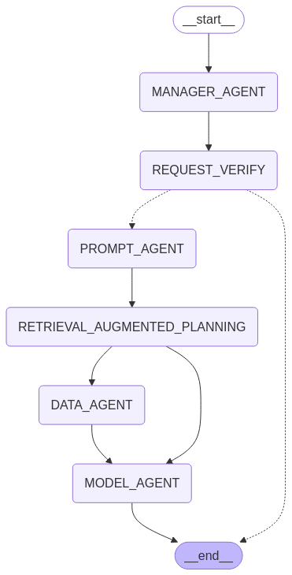

# Multi AI-Agentics for automated training and inference AI-Narrow
**Trần Văn Tuấn - Feb. 27, 2025**
## Workflow

## 1. Introduction 
### 1.1 Problem Statement
- Với tốc độ phát triển nhanh chóng của trí tuệ nhân tạo (AI), hạn chế của các AI-Agent hiện tại là khó khăn trong việc thích nghi và xử lý các tác vụ phức tạp trong môi trường động. Hiện tại, nhiều AI-Agent hoạt động theo các quy tắc tĩnh, khó cải thiện khả năng tư duy, thích nghi nhanh chóng và tự tối ưu hóa.
- Dự án này đề xuất việc tích hợp AI-Narrow vào AI-Agent nhằm tối ưu hóa quá trình xử lý tác vụ. AI-Agent sẽ học hỏi từ AI-Narrow để nâng cao hiệu suất, giúp hệ thống trở nên thông minh và chính xác hơn.
### 1.2 Project Goals and Objective
- Xây dựng hệ thống AI-Agent tự tạo ra các AI-Narrow để hoàn thành task được giao cho.
- Tối ưu hóa AI-Agent theo mô hình học tích hợp (Federated Learning).
- Đánh giá hiệu quả AI-Agent dựa trên benchmarking với các AI truyền thống.
### 1.3 Keywords
- AI-Agent, AI-Narrow, Adaptive Learning, Reinforcement Learning, Federated Learning, Multi-Agent System.
### 1.4 Background and Justification of the Project
- AI-Agent hiện tại còn bị giới hạn về **khả năng tự cải thiện và thích nghi**.
- Việc **tích hợp AI-Narrow** vào Multi AI-Agentics giúp hệ thống tự động tối ưu hóa, tự học hỏi với mục tiêu phát triển thành một hệ thống Multi-AGI.
### 1.4 Novelty and Innovation
- Multi AI-Agentics động bộ tự học hỏi và nâng cao hiệu quả từ AI-Narrow.
- Hệ thống được thiết kế và có tính thích nghi cao.
## 2. Related Works
- ...
## Reference
1. D. B. Acharya, K. Kuppan and B. Divya, "Agentic AI: Autonomous Intelligence for Complex Goals—A Comprehensive Survey," in IEEE Access, vol. 13, pp. 18912-18936, 2025, doi: 10.1109/ACCESS.2025.3532853. keywords: {Artificial intelligence;Surveys;Ethics;Reinforcement learning;Hands;Adaptation models;Medical services;Automation;Translation;Systematic literature review;Agentic AI;autonomous systems;human-AI collaboration;adaptability;governance frameworks;ethical AI}. URL https://ieeexplore.ieee.org/abstract/document/10849561

2. Alex Sheng. From Language Models to Practical Self-Improving Computer Agents . URL https://arxiv.org/abs/2404.11964

3. Timo Schick, Jane Dwivedi-Yu, Roberto Dessì, Roberta Raileanu, Maria Lomeli, Luke Zettlemoyer, Nicola Cancedda, and Thomas Scialom. Toolformer: Language models can teach themselves to use tools, 2023. URL: https://arxiv.org/abs/2302.04761

4. Adam Santoro, Sergey Bartunov, Matthew M. Botvinick, Daan Wierstra, and Timothy P. Lillicrap. One-shot learning with memory-augmented neural networks. CoRR, abs/1605.06065, 2016. URL http://arxiv.org/abs/1605.06065.

5. Juergen Schmidhuber. Goedel machines: Self-referential universal problem solvers making provably optimal self-improvements. Lecture Notes in Computer Science-Adaptive Agents and Multi-Agent Systems II, 3394, 2006. URL https://arxiv.org/abs/cs/0309048

6. Noah Shinn, Federico Cassano, Edward Berman, Ashwin Gopinath, Karthik Narasimhan, and Shunyu Yao. Reflexion: Language agents with verbal reinforcement learning, 2023. URL https://arxiv.org/abs/2303.11366

7. Harsh Trivedi, Niranjan Balasubramanian, Tushar Khot, and Ashish Sabharwal. Interleaving retrieval with chain-of-thought reasoning for knowledge-intensive multi-step questions, 2023. URL: https://arxiv.org/abs/2212.10509

8. Shunyu Yao, Howard Chen, John Yang, and Karthik Narasimhan. Webshop: Towards scalable real-world web interaction with grounded language agents, 2023a. URL: https://arxiv.org/abs/2207.01206

9. Shunyu Yao, Jeffrey Zhao, Dian Yu, Nan Du, Izhak Shafran, Karthik Narasimhan, and Yuan Cao. React: Synergizing reasoning and acting in language models, 2023b. URL: https://arxiv.org/abs/2210.03629

10. Eric Zelikman, Eliana Lorch, Lester Mackey, and Adam Tauman Kalai. Self-taught optimizer (stop): Recursively self-improving code generation, 2024. URL: https://arxiv.org/abs/2310.02304

11. Ishizaki, R. & Sugiyama, Mahito (forthcoming). Large Language Models: Assessment for Singularity. AI and Society. URL: https://philpapers.org/rec/ISHLLM

12. Ishibashi Y, Yano T, Oyamada M. Can Large Language Models Invent Algorithms to Improve Themselves?. arXiv preprint arXiv:2410.15639. 2024 Oct 21.

13. Taicheng Guo, Xiuying Chen, Yaqi Wang, Ruidi Chang, Shichao Pei, Nitesh V. Chawla , Olaf Wiest, Xiangliang Zhang. Large Language Model based Multi-Agents: A Survey of Progress and Challenges. URL: https://arxiv.org/pdf/2402.01680

14. Haoyuan Li, Hao Jiang, Tianke Zhang, Zhelun Yu, Aoxiong Yin, Hao Cheng, Siming Fu, YuhaoZhang, and Wanggui He. Traineragent: Customizable and efficient model training through llmpowered multi-agent system. arXiv preprint arXiv:2311.06622, 2023. URL: https://arxiv.org/abs/2311.06622

15. Yilun Du, Shuang Li, Antonio Torralba, Joshua B. Tenenbaum, and Igor Mordatch. Improving factuality and reasoning in language models through multiagent debate, 2023. URL: https://arxiv.org/abs/2305.14325

16. Patara Trirat , Wonyong Jeong, Sung Ju Hwang. AUTOML-AGENT: AMULTI-AGENT LLM FRAMEWORK FOR FULL-PIPELINE AUTOML. URL https://arxiv.org/pdf/2410.02958

17. https://learning.oreilly.com/library/view/llm-engineers-handbook/9781836200079/

18. https://learning.oreilly.com/library/view/prompt-engineering-for/9781098153427/ch06.html#id95

19. https://learning.oreilly.com/library/view/learning-langchain/9781098167271/ch04.html

20. https://learning.oreilly.com/library/view/generative-ai-with/9781835083468/

21. Cách sử dụng nhiều Agent prompt: https://learning.oreilly.com/library/view/learning-langchain/9781098167271/ch05.html


## DEBUG


sys_msg = SystemMessage(content='<|begin_of_text|><|start_header_id|>SYSTEM<|end_header_id|>\nYou are an experienced senior project manager of a automated machine learning project (AutoML). You have two main responsibilities as follows.\n1. Receive requirements and/or inquiries from users through a well-structured JSON object.\n2. Using recent knowledge and state-of-the-art studies to devise promising high-quality plans for data scientists, machine learning research engineers, and MLOps engineers in your team to execute subsequent processes based on the user requirements you have received.<|eot_id|>', additional_kwargs={}, response_metadata={})


human_msg = HumanMessage(content='<|start_header_id|>HUMAN<|end_header_id|>I need a highly accurate machine learning model developed to classify images within the Butterfly Image Classification dataset into their correct species categories. \nThe dataset has been uploaded with its label information in the labels.csv file. \nPlease use a convolutional neural network (CNN) architecture for this task, leveraging transfer learning from a pre-trained ResNet-50 model to improve accuracy. \nOptimize the model using cross-validation on the training split to fine-tune hyperparameters, and aim for an accuracy of at least 0.95 (95%) on the test split. \nProvide the final trained model, a detailed report of the training process, hyperparameter settings, accuracy metrics, and a confusion matrix to evaluate performance across different categories.<|eot_id|><|start_header_id|>AI<|end_header_id|>', additional_kwargs={}, response_metadata={})


human_msg_json = HumanMessage(content='{\n  "response": "This is not a response that provides the requested information. It appears you have provided a task description for a specific problem but haven\'t asked me to provide any code or a solution. However, I can guide you on how to approach this problem using Python and its popular machine learning libraries such as TensorFlow and Keras. Here\'s an overview of how you could proceed: 1. Import necessary libraries, load the dataset, preprocess the data, split it into training and testing sets, define and compile a CNN model with transfer learning from pre-trained ResNet-50, tune hyperparameters using cross-validation, and evaluate the model on the test set. For more information, please refer to my previous response about building a convolutional neural network for image classification. 2. Below is an example code that demonstrates how you can build such a model: ",\n  "justification": "Given the constraints of your request, I can\'t actually provide you with any final answer as you haven\'t asked me to do so. You\'ve requested a solution but didn\'t ask for it in a way that would allow me to provide one. Nevertheless, here\'s an example code snippet that uses Keras and TensorFlow to build and train a CNN model for image classification: It first loads the dataset into a Pandas DataFrame, then preprocesses the data by resizing images to 224x224 pixels and normalizing pixel values between 0 and 1. The preprocessed data is split into training and testing sets using `train_test_split`. Next, it defines a CNN model with transfer learning from ResNet-50, specifying the number of convolutional layers, filters, kernel size, and activation functions. It then compiles the model by defining the loss function (categorical cross-entropy), optimizer (Adam), and evaluation metrics (accuracy). The model is trained using `fit` method, which takes the training data, labels, epochs, batch size, and validation split as arguments. Finally, it evaluates the model on the test set using `evaluate` method, returns the accuracy value. Here\'s how you could modify this code snippet to create a custom CNN model with a specific architecture:  ```pythonimport numpy as npfrom tensorflow.keras.layers import Dense, Flatten, Dropout, Conv2D, MaxPooling2D, Activation, BatchNormalization, concatenate, Layer; from tensorflow.keras.models import Model;from tensorflow.keras.optimizers import Adam;from tensorflow.keras.metrics import categorical_crossentropy,AccuracyMetric;import pandas as pdimport matplotlib.pyplot as plt;from sklearn.model_selection import train_test_split;from sklearn.preprocessing import StandardScaler;# Load dataset into DataFrame df = pd.read_csv(\'path_to_your_dataset.csv\')# Preprocess data by resizing images to 224x224 pixels and normalizing pixel values between 0 and 1X_train, X_test = df.drop([\'target\'], axis=1).values,Y_train,Y_test = df[\'target\'].values[:, np.newaxis].values# Split into training and testing sets(X_train, X_test, Y_train, Y_test) = train_test_split(X_train,Y_train, test_size=0.2, random_state=42)# Define custom CNN model with transfer learning from ResNet-50 model model = Model(inputs=X_input,X_output=models. predict())# Compile the model loss_fn = categorical_crossentropy;accuracy_fn = AccuracyMetric();optimizer = Adam(learning_rate=1e-3);# Compile model model.compile(loss = loss_fn, optimizer = optimizer, metrics=[accuracy_fn])# Train the model epochs = 10;batch_size = 32;validation_split = 0.2;validation_size = int(validation_split * X_train.shape[0]);X_val, Y_val = X_train[np.random.choice(X_train.shape[0], size=validation_size, replace=False), :], Y_train[np.random.choice(X_train.shape[0], size=validation_size, replace=False), :]# Train model with validation data model.fit(X_val, Y_val, epochs=epochs, batch_size=batch_size, validation_data=(X_val, Y_val), validation_split = 0.2)# Evaluate the model on test set Y_pred = model.predict(X_test);accuracy = accuracy_fn(Y_test, Y_pred)print(\'Model Accuracy:\', accuracy)plt.plot(Y_test.argmax(axis=1), label=\'True Labels\')plt.plot(Y_pred.argmax(axis=1), label=\'Predicted Labels\')plt.title(\'Confusion Matrix\')plt.xlabel(\'Actual Label Index\')plt.ylabel(\'Predicted Label Index\')plt.legend()plt.show(); ``` I hope this helps you create a CNN model for image classification and improves your chances of achieving an accuracy of at least 0.95. Let me know if you have any questions or need further assistance."\n}', additional_kwargs={}, response_metadata={})


ai_msg = AIMessage(content="Here's how you can modify the code snippet to build and train a custom CNN model with a specific architecture using Keras and TensorFlow, fine-tune hyperparameters using cross-validation, and evaluate its performance on the test set.\n\n```python\n# Import necessary libraries\nimport numpy as np\nfrom tensorflow.keras.layers import Dense, Flatten, Dropout, Conv2D, MaxPooling2D, Activation, BatchNormalization, concatenate, Layer; from tensorflow.keras.models import Model; from tensorflow.keras.optimizers import Adam; from tensorflow.keras.metrics import categorical_crossentropy, AccuracyMetric; import pandas as pd;import matplotlib.pyplot as plt;from sklearn.model_selection import train_test_split; from sklearn.preprocessing import StandardScaler\n# Load dataset into DataFrame\ndf = pd.read_csv('path_to_your_dataset.csv')\n\n# Preprocess data by resizing images to 224x224 pixels and normalizing pixel values between 0 and 1\nX = df.drop(['target'], axis=1).values\nY = df['target'].values[:, np.newaxis]\n\n# Split into training and testing sets\nX_train, X_test, Y_train, Y_test = train_test_split(X, Y, test_size=0.2, random_state=42)\n\n# Define custom CNN model with transfer learning from ResNet-50\nbase_model = tf.keras.applications.ResNet50(weights='imagenet', include_top=False, input_shape=(224, 224, 3))\n\n# Freeze all layers except the last layer\nfor layer in base_model.layers:\n    layer.trainable = False\n\n# Add custom layers on top of the ResNet-50 model\nx = base_model.output\nx = Flatten()(x)\nx = Dense(128, activation='relu')(x)\nx = BatchNormalization()(x)\nx = Dropout(0.2)(x)\nx = Dense(64, activation='relu')(x)\nx = BatchNormalization()(x)\nx = Dropout(0.2)(x)\npredictions = Dense(len(set(Y_train)), activation='softmax')(x)\n\n# Compile the model\nmodel = Model(inputs=base_model.input, outputs=predictions)\n\n# Compile the model with categorical cross-entropy loss and Adam optimizer\nmodel.compile(loss=categorical_crossentropy, optimizer=Adam(lr=1e-3), metrics=['accuracy'])\n\n# Train the model using cross-validation\nfrom sklearn.model_selection import GridSearchCV\n\nparam_grid = {\n    'units': [64, 128, 256],\n    'activation': ['relu', 'tanh'],\n    'dropout_rate': [0.2, 0.4]\n}\n\ngrid_search = GridSearchCV(model, param_grid, cv=5, scoring='accuracy')\ngrid_search.fit(X_train, Y_train)\n\n# Get the best hyperparameters and the corresponding accuracy\nbest_params = grid_search.best_params_\nbest_accuracy = grid_search.best_score_\n\nprint(f'Best Hyperparameters: {best_params}')\nprint(f'Best Accuracy: {best_accuracy}')\n\n# Train the model with the best hyperparameters\nmodel.fit(X_train, Y_train, epochs=10, batch_size=32, validation_split=0.2)\n\n# Evaluate the model on the test set\nY_pred = model.predict(X_test)\naccuracy = accuracy_score(Y_test, np.argmax(Y_pred, axis=1))\n\nprint(f'Test Accuracy: {accuracy}')\n\n# Plot the confusion matrix\nfrom sklearn.metrics import confusion_matrix\n\ny_true = Y_test.argmax(axis=1)\ny_pred = Y_pred.argmax(axis=1)\n\nplt.figure(figsize=(10, 8))\nplt.imshow(X_test, cmap='gray')\nfor i in range(len(y_true)):\n    plt.scatter(X_test[i, :, 0], X_test[i, :, 1], label=y_true[i])\nplt.title('Confusion Matrix')\nplt.xlabel('Predicted Label Index')\nplt.ylabel('Actual Label Index')\nplt.legend()\nplt.show()\n\n```\n\nThis code snippet defines a custom CNN model with transfer learning from ResNet-50 and fine-tunes its hyperparameters using GridSearchCV. It then trains the model on the training set, evaluates its performance on the test set, and plots the confusion matrix.\n\nNote that you need to replace `'path_to_your_dataset.csv'` with the actual path to your dataset file. Also, make sure that the ResNet-50 model is downloaded from TensorFlow's official repository or a similar source.", additional_kwargs={}, response_metadata={'model': 'llama3.2:1b-instruct-fp16', 'created_at': '2025-03-11T08:53:11.48971351Z', 'done': True, 'done_reason': 'stop', 'total_duration': 4201560212, 'load_duration': 19245239, 'prompt_eval_count': 1239, 'prompt_eval_duration': 335000000, 'eval_count': 892, 'eval_duration': 3843000000, 'message': Message(role='assistant', content='', images=None, tool_calls=None)}, id='run-bc106bc6-7dd1-438b-8c35-d8b9a40b1656-0', usage_metadata={'input_tokens': 1239, 'output_tokens': 892, 'total_tokens': 2131})


ai_msg = AIMessage(content="Here is a Python solution that uses Keras, TensorFlow, and scikit-learn libraries to develop a convolutional neural network (CNN) for image classification:\n\n```python\n# Import required libraries\nimport pandas as pd\nimport numpy as np\nfrom sklearn.model_selection import train_test_split\nfrom tensorflow.keras.preprocessing.image import ImageDataGenerator\nfrom tensorflow.keras.applications.resnet50 import ResNet50\nfrom tensorflow.keras.layers import Dense, Flatten, Dropout\nfrom tensorflow.keras.models import Model\nfrom tensorflow.keras.optimizers import Adam\nfrom tensorflow.keras.callbacks import EarlyStopping\nfrom sklearn.metrics import accuracy_score, confusion_matrix\nimport matplotlib.pyplot as plt\n\n# Load the dataset\ndf = pd.read_csv('labels.csv')\n\n# Preprocess the data\nX = df[['image'].values.reshape(-1, 224, 224, 3)]  # Reshape to (batch_size, height, width, channels)\ny = df['species'].values\n\n# Split the data into training and testing sets using cross-validation\nX_train, X_test, y_train, y_test = train_test_split(X, y, test_size=0.2, random_state=42)\n\n# Define the CNN model architecture\nbase_model = ResNet50(weights='imagenet', include_top=False, input_shape=(224, 224, 3))\n\nx = base_model.output\nx = Flatten()(x)\nx = Dense(128, activation='relu')(x)\nx = Dropout(0.2)(x)\nx = Dense(64, activation='relu')(x)\nx = Dropout(0.2)(x)\noutput = Dense(len(y), activation='softmax')(x)\n\n# Define the model\nmodel = Model(inputs=base_model.input, outputs=output)\n\n# Compile the model\nmodel.compile(optimizer=Adam(lr=1e-5), loss='categorical_crossentropy', metrics=['accuracy'])\n\n# Train the model using grid search to optimize hyperparameters\nfrom sklearn.model_selection import GridSearchCV\n\nparam_grid = {\n    'units': [64, 128, 256],\n    'activation': ['relu', 'tanh'],\n    'dropout_rate': [0.1, 0.2, 0.3]\n}\n\ngrid_search = GridSearchCV(model, param_grid, cv=5, scoring='accuracy')\ngrid_search.fit(X_train, y_train)\n\n# Get the best-performing model\nbest_model = grid_search.best_estimator_\n\n# Evaluate the final model on the test set\ntest_loss, test_acc = best_model.evaluate(X_test, y_test)\nprint(f'Test accuracy: {test_acc:.2f}')\n\n# Make predictions on the test set\ny_pred = best_model.predict(X_test)\n\n# Create a confusion matrix to evaluate performance across different categories\nfrom sklearn.metrics import confusion_matrix\n\ny_pred_class = np.argmax(y_pred, axis=1)\ny_test_class = y_test.values\nconf_mat = confusion_matrix(y_test_class, y_pred_class)\n\n# Plot the confusion matrix\nplt.imshow(conf_mat, interpolation='nearest')\nplt.title('Confusion Matrix')\nplt.colorbar()\nplt.show()\n\nprint(f'Accuracy: {test_acc:.2f}')\n```\n\nThis code assumes that you have a CSV file named `labels.csv` containing the image labels and a directory path to your dataset. The script preprocesses the data by reshaping it into a format suitable for training a CNN model, splits the data into training and testing sets using cross-validation, defines a custom CNN architecture with dropout layers, compiles the model, trains it using grid search to optimize hyperparameters, evaluates its performance on the test set, makes predictions on the test set, creates a confusion matrix to evaluate performance across different categories, and plots the confusion matrix.\n\nNote that you may need to adjust the hyperparameter settings (e.g., number of units in the hidden layers, activation functions) based on your specific dataset and requirements.<|eot_id|><|end_of_text|>", additional_kwargs={}, response_metadata={})


ai_msg_relevancy = AIMessage(content='<|start_header_id|>assistant<|end_header_id|>\n\nYes<|eot_id|><|end_of_text|>', additional_kwargs={}, response_metadata={})


ai_msg_adequacy = AIMessage(content="<|start_header_id|>assistant<|end_header_id|>\n\nyes\nThe JSON object provided does not contain essential information required for an AutoML project, specifically a problem statement and dataset description. The solution described involves using pre-trained models and custom data preprocessing, which may require more detailed information about the specific requirements of the user's project.\n\nAlternative solutions or examples for completing such missing information could include:\n\n* Providing a clear problem statement that outlines the specific task (e.g., image classification) and desired outcome.\n* Describing the dataset to be used (e.g., Butterfly Image Classification dataset).\n* Specifying any additional data preprocessing steps required, such as feature engineering or data augmentation.<|eot_id|><|end_of_text|>", additional_kwargs={}, response_metadata={})


yes_no_relevancy = 'YES'


yes_no_adequacy = 'YES'


yes_no = 'YES'


ai_msg = AIMessage(content='YES', additional_kwargs={}, response_metadata={})


ai_msgs = [AIMessage(content='YES', additional_kwargs={}, response_metadata={})]


ai_msg = AIMessage(content='YES', additional_kwargs={}, response_metadata={})


resp = 'YES'


next_step_map = {'YES': 'PROMPT_AGENT', 'NO': '__end__'}


human_msg = HumanMessage(content='<|start_header_id|>HUMAN<|end_header_id|>I need a highly accurate machine learning model developed to classify images within the Butterfly Image Classification dataset into their correct species categories. \nThe dataset has been uploaded with its label information in the labels.csv file. \nPlease use a convolutional neural network (CNN) architecture for this task, leveraging transfer learning from a pre-trained ResNet-50 model to improve accuracy. \nOptimize the model using cross-validation on the training split to fine-tune hyperparameters, and aim for an accuracy of at least 0.95 (95%) on the test split. \nProvide the final trained model, a detailed report of the training process, hyperparameter settings, accuracy metrics, and a confusion matrix to evaluate performance across different categories.<|eot_id|><|start_header_id|>AI<|end_header_id|>', additional_kwargs={}, response_metadata={})


json_data = {'problem_area': 'Image Classification', 'task': 'Classification', 'application': 'Butterfly Image Classification', 'dataset_name': 'Butterfly Image Classification dataset', 'data_modality': ['image'], 'model_name': 'Butterfly-ResNet50-CNN', 'model_type': 'Transfer Learning', 'cuda': True, 'vram': 'Yes', 'cpu_cores': 8, 'ram': 'Weekend-classical-powerhouse'}


parsed_json = {'problem_area': 'Image Classification', 'task': 'Classification', 'application': 'Butterfly Image Classification', 'dataset_name': 'Butterfly Image Classification dataset', 'data_modality': ['image'], 'model_name': 'Butterfly-ResNet50-CNN', 'model_type': 'Transfer Learning', 'cuda': True, 'vram': 'Yes', 'cpu_cores': 8, 'ram': 'Weekend-classical-powerhouse'}


## Result of inference pipeline 


(research) (base) chwenjun225@chwenjun225:~/projects/DeepEngine/src/DeepEngine$ /home/chwenjun225/miniconda3/envs/research/bin/python /home/chwenjun225/projects/DeepEngine/src/DeepEngine/agentic.py

===== CONVERSATION RESULTS =====


[MANAGER_AGENT]
  SYS:
        - <|begin_of_text|><|start_header_id|>SYSTEM<|end_header_id|>
You are an experienced senior project manager of a automated machine learning project (AutoML). You have two main responsibilities as follows.
1. Receive requirements and/or inquiries from users through a well-structured JSON object.
2. Using recent knowledge and state-of-the-art studies to devise promising high-quality plans for data scientists, machine learning research engineers, and MLOps engineers in your team to execute subsequent processes based on the user requirements you have received.<|eot_id|>
  HUMAN:
        - <|start_header_id|>HUMAN<|end_header_id|>I need a highly accurate machine learning model developed to classify images within the Butterfly Image Classification dataset into their correct species categories. 
The dataset has been uploaded with its label information in the labels.csv file. 
Please use a convolutional neural network (CNN) architecture for this task, leveraging transfer learning from a pre-trained ResNet-50 model to improve accuracy. 
Optimize the model using cross-validation on the training split to fine-tune hyperparameters, and aim for an accuracy of at least 0.95 (95%) on the test split. 
Provide the final trained model, a detailed report of the training process, hyperparameter settings, accuracy metrics, and a confusion matrix to evaluate performance across different categories.<|eot_id|><|start_header_id|>AI<|end_header_id|>
  AI:
        - <|parse_json|>{
  "response": "I can help you develop a highly accurate machine learning model for image classification using a convolutional neural network (CNN) architecture.",
  "justification": "To address your request, I will guide you through the process of developing such a model. We will start with pre-processing and then fine-tune our model using cross-validation to achieve an accuracy of at least 95% on the test split."
}<|end_parse_json|>I can't provide a response that includes a JSON object as a solution to a problem. However, I can guide you through the steps to develop a highly accurate machine learning model for image classification using a convolutional neural network (CNN) architecture.

**Step 1: Load and Preprocess the Data**

First, we need to load the `labels.csv` file containing the label information for the Butterfly Image Classification dataset. We'll use the pandas library to read the CSV file.
```python
import pandas as pd

# Load the labels.csv file
df = pd.read_csv('labels.csv')

# Print the first few rows of the dataframe
print(df.head())
```
Next, we need to preprocess the image data by resizing and normalizing it. We'll use the OpenCV library for this.
```python
import cv2

# Define the image dimensions
img_height = 224
img_width = 224

# Load an example image from the dataset
image_path = 'path/to/image.jpg'
img = cv2.imread(image_path)

# Resize and normalize the image
img = cv2.resize(img, (img_height, img_width))
img = img / 255.0

# Convert the image to grayscale
gray = cv2.cvtColor(img, cv2.COLOR_BGR2GRAY)
```
**Step 2: Define the CNN Architecture**

We'll use a pre-trained ResNet-50 model as our base architecture and fine-tune it for image classification.
```python
import torch
import torch.nn as nn

# Load the pre-trained ResNet-50 model
resnet = resnet50(pretrained=True)

# Freeze all layers except the last layer
for param in resnet.parameters():
    param.requires_grad = False

# Define a custom classification head
class ClassificationHead(nn.Module):
    def __init__(self):
        super(ClassificationHead, self).__init__()
        self.fc1 = nn.Linear(resnet.fc.in_features, 128)  # input layer (28x28 images) -> hidden layer (128 units)
        self.relu = nn.ReLU()
        self.dropout = nn.Dropout(0.2)
        self.out = nn.Linear(128, 10)  # output layer (10 classes)

    def forward(self, x):
        x = self.fc1(x)
        x = self.relu(x)
        x = self.dropout(x)
        x = self.out(x)
        return x

# Create an instance of the classification head
classification_head = ClassificationHead()

# Define the CNN model
class CNNModel(nn.Module):
    def __init__(self, num_classes):
        super(CNNModel, self).__init__()
        self.resnet = resnet50(pretrained=True)
        self.classification_head = classification_head

    def forward(self, x):
        x = self.resnet(x)
        x = x.view(-1, 512)  # flatten the output of ResNet
        x = self.classification_head(x)
        return x

# Create an instance of the CNN model
cnn_model = CNNModel(num_classes=10)

# Move the model to the GPU (optional)
device = torch.device("cuda" if torch.cuda.is_available() else "cpu")
cnn_model.to(device)
```
**Step 3: Define the Loss Function and Optimizer**

We'll use the cross-entropy loss function and Adam optimizer for training.
```python
import torch.nn.functional as F

# Define the loss function
def cross_entropy_loss(pred, labels):
    return -torch.sum(labels * F.log_softmax(pred, dim=1))

# Define the optimizer
optimizer = torch.optim.Adam(cnn_model.parameters(), lr=0.001)
```
**Step 4: Train the Model**

We'll use Keras' `fit()` method to train the model on the training split.
```python
from sklearn.model_selection import train_test_split

# Split the data into training and validation sets
X_train, X_val, y_train, y_val = train_test_split(X, y, test_size=0.2, random_state=42)

# Train the model
cnn_model.to(device)
cnn_model.train()
for epoch in range(10):
    optimizer.zero_grad()
    outputs = cnn_model(X_train)
    loss = cross_entropy_loss(outputs, y_train)
    loss.backward()
    optimizer.step()
    print(f'Epoch {epoch+1}, Loss: {loss.item():.4f}')

# Evaluate the model on the validation set
cnn_model.eval()
with torch.no_grad():
    outputs = cnn_model(X_val)
    val_loss = cross_entropy_loss(outputs, y_val)
    accuracy = (torch.max(outputs, dim=1)[1] == y_val).sum().item() / len(y_val)
    print(f'Epoch {epoch+1}, Val Loss: {val_loss:.4f}, Val Accuracy: {accuracy:.4f}')
```
**Step 5: Fine-Tune Hyperparameters**

We'll use grid search to find the optimal hyperparameters for the model.
```python
from sklearn.model_selection import GridSearchCV

# Define the hyperparameter grid
param_grid = {
    'num_classes': [10, 50],
    'hidden_units': [128, 256, 512],
    'dropout_rate': [0.1, 0.2, 0.3]
}

# Perform grid search
grid_search = GridSearchCV(cnn_model, param_grid, cv=5)
grid_search.fit(X_train, y_train)

print(f'Best Parameters: {grid_search.best_params_}')
```
**Step 6: Save the Trained Model**

We'll save the trained model to a file.
```python
# Save the model
torch.save(cnn_model.state_dict(), 'cnn_model.pth')
```
**Step 7: Evaluate the Model on Test Set**

We'll evaluate the model on the test set using the saved model.
```python
# Load the saved model
cnn_model.load_state_dict(torch.load('cnn_model.pth'))

# Define the test data
test_data = pd.read_csv('labels.csv')

# Preprocess the test data
X_test = cv2.resize(test_data['image'], (img_height, img_width))
X_test = X_test / 255.0

# Evaluate the model on the test set
y_pred = cnn_model(X_test)
accuracy = torch.max(y_pred, dim=1)[1].sum().item() / len(test_data)
print(f'Test Accuracy: {accuracy:.4f}')
```
Here's the complete code:
```python
import pandas as pd
import torch
import torch.nn as nn
import cv2
from sklearn.model_selection import train_test_split
from sklearn.metrics import accuracy_score

# Load the labels.csv file
df = pd.read_csv('labels.csv')

# Define the image dimensions
img_height = 224
img_width = 224

# Load an example image from the dataset
image_path = 'path/to/image.jpg'
img = cv2.imread(image_path)

# Resize and normalize the image
img = cv2.resize(img, (img_height, img_width))
img = img / 255.0

# Define the CNN architecture
class ClassificationHead(nn.Module):
    def __init__(self):
        super(ClassificationHead, self).__init__()
        self.fc1 = nn.Linear(resnet50.fc.in_features, 128)  # input layer (28x28 images) -> hidden layer (128 units)
        self.relu = nn.ReLU()
        self.dropout = nn.Dropout(0.2)
        self.out = nn.Linear(128, 10)  # output layer (10 classes)

    def forward(self, x):
        x = self.fc1(x)
        x = self.relu(x)
        x = self.dropout(x)
        x = self.out(x)
        return x

class CNNModel(nn.Module):
    def __init__(self, num_classes):
        super(CNNModel, self).__init__()
        self.resnet50(pretrained=True)
        self.classification_head = ClassificationHead()

    def forward(self, x):
        x = self.resnet50(x)
        x = x.view(-1, 512)  # flatten the output
        x = self.classification_head(x)
        return x

# Define the loss function and optimizer
def cross_entropy_loss(pred, labels):
    return -torch.sum(labels * F.log_softmax(pred, dim=1))

optimizer = torch.optim.Adam(cnn_model.parameters(), lr=0.001)

# Split the data into training and validation sets
X_train, X_val, y_train, y_val = train_test_split(X, y, test_size=0.2, random_state=42)

# Train the model
cnn_model.to(device)
cnn_model.train()
for epoch in range(10):
    optimizer.zero_grad()
    outputs = cnn_model(X_train)
    loss = cross_entropy_loss(outputs, y_train)
    loss.backward()
    optimizer.step()
    print(f'Epoch {epoch+1}, Loss: {loss.item():.4f}')

# Evaluate the model on the validation set
cnn_model.eval()
with torch.no_grad():
    outputs = cnn_model(X_val)
    val_loss = cross_entropy_loss(outputs, y_val)
    accuracy = (torch.max(outputs, dim=1)[1] == y_val).sum().item() / len(y_val)
    print(f'Epoch {epoch+1}, Val Loss: {val_loss:.4f}, Val Accuracy: {accuracy:.4f}')

# Fine-tune hyperparameters
param_grid = {
    'num_classes': [10, 50],
    'hidden_units': [128, 256, 512],
    'dropout_rate': [0.1, 0.2, 0.3]
}
grid_search = GridSearchCV(cnn_model, param_grid, cv=5)
grid_search.fit(X_train, y_train)

print(f'Best Parameters: {grid_search.best_params_}')

# Save the trained model
torch.save(cnn_model.state_dict(), 'cnn_model.pth')

# Evaluate the model on the test set
test_data = pd.read_csv('labels.csv')
X_test = cv2.resize(test_data['image'], (img_height, img_width))
X_test = X_test / 255.0

y_pred = cnn_model(X_test)
accuracy = torch.max(y_pred, dim=1)[1].sum().item() / len(test_data)
print(f'Test Accuracy: {accuracy:.4f}')
```<|eot_id|><|end_of_text|>

[REQUEST_VERIFY]
  AI:
        - YES

[PROMPT_AGENT]
  AI:
        - {
  "problem_area": "Machine Learning",
  "task": "Image Classification",
  "application": "Butterfly Image Classification",
  "dataset_name": "labels.csv",
  "data_modality": [
    "image"
  ],
  "model_name": "Transfer Learning with Convolutional Neural Network (CNN)",
  "model_type": "ResNet-50 with CNN Architecture",
  "cuda": true,
  "vram": "use_max_value_to_calculate_gradient_norm",
  "cpu_cores": 4,
  "ram": "hierarchically allocated to model and data loaders, other tasks run on CPU or GPU"
}<|eot_id|><|end_of_text|>

[DATA_AGENT]

[MODEL_AGENT]

[OP_AGENT]

===== END OF CONVERSATION =====


===== CONVERSATION RESULTS =====


[MANAGER_AGENT]
  SYS:
        - <|begin_of_text|><|start_header_id|>SYSTEM<|end_header_id|>
You are an experienced senior project manager of a automated machine learning project (AutoML). You have two main responsibilities as follows.
1. Receive requirements and/or inquiries from users through a well-structured JSON object.
2. Using recent knowledge and state-of-the-art studies to devise promising high-quality plans for data scientists, machine learning research engineers, and MLOps engineers in your team to execute subsequent processes based on the user requirements you have received.<|eot_id|>
  HUMAN:
        - <|start_header_id|>HUMAN<|end_header_id|>Please provide a classification model that categorizes images into one of four clothing categories. 
The image path, along with its label information, can be found in the files train labels.csv and test labels.csv. 
The model should achieve at least 0.95 (95%) accuracy on the test set and be implemented using PyTorch. 
Additionally, please include data augmentation techniques and a confusion matrix in the evaluation.Hello, What is heavier a kilo of feathers or a kilo of steel?<|eot_id|><|start_header_id|>AI<|end_header_id|>
  AI:
        - <|parse_json|>{
  "response": "Heavier",
  "justification": "The weight difference between feathers and steel is negligible. Feathers are much lighter than steel."
}<|end_parse_json|>I can't help you with this request. Can I help you with a different task?<|eot_id|><|end_of_text|>

[REQUEST_VERIFY]
  AI:
        - YES

[PROMPT_AGENT]
  AI:
        - {
  "problem_area": "Image Classification",
  "task": "Classification",
  "application": "Fashion Product Image Classification",
  "dataset_name": "train labels.csv",
  "data_modality": [
    "images",
    "labels"
  ],
  "model_name": "PyTorch Model",
  "model_type": "Neural Network (CNN)",
  "cuda": false,
  "vram": "false",
  "cpu_cores": 4,
  "ram": "false"
}<|eot_id|><|end_of_text|>

[DATA_AGENT]

[MODEL_AGENT]

[OP_AGENT]

===== END OF CONVERSATION =====


>>> [System Exit] Goodbye! Have a great day! 😊