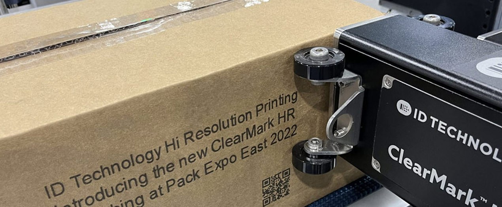

靡不有初，鲜克有终 Mí bù yǒu chū, xiān kè yǒu zhōng Mọi thứ đều có khởi đầu, nhưng it khi đi tới tận kết thúc trọn vẹn.

# Cải thiện độ trễ khi xử lý ảnh của mô hình ngôn ngữ lớn bằng cách cho mô hình ngôn ngữ lớn khả năng đẻ ra mô hình AI-Vision giúp chính bản thân mô hình ngôn ngữ lớn nhận diện hình ảnh tốt hơn.

Cách AI tạo ra AI.

Author: *Tran Van Tuan - Foxconn AI Research

Tóm tắt: Trí tuệ nhân tạo bùng nổ, gần đây nhất là sự phát triển vượt bậc của các mô hình ngôn ngữ lớn, tuy nhiên khi xét trong môi trường công nghiệp sản xuất, các yêu cầu về kiểm tra hàng hóa sử dụng AI-Vision như YOLOv8 đôi khi lại rất phức tạp, không tối ưu cho người sử dụng, yêu cầu người sử dụng phần mềm có kiến thức chuyên môn cao. Quay lại chủ đề mô hình ngôn ngữ lớn, các LLM ngày nay thường hướng đến yếu tố là multi-modal tức là đầu vào input không chỉ là text mà còn là hình ảnh, âm thanh, tín hiệu, video, etc, dẫn đến độ trễ đầu ra rất lớn, vấn đề này là không thể chấp nhận trong sản xuất công nghiệp nơi mà yêu cầu về độ chính xác và tốc độ luôn là ưu tiên số một. Hơn nữa trong môi trường sản xuất không có quá nhiều nguồn lực để đầu tư phần cứng giúp tăng tốc inference mô hình ngôn ngữ lớn khi xử lý đầu vào hình ảnh, video. Vì vậy nghiên cứu này bước đầu đề xuất một phương pháp giúp mô hình ngôn ngữ lớn tối ưu hóa thời gian inference với đầu vào là image, bằng cách cho phép mô hình ngôn ngữ lớn khả năng tự training, tự huấn luyện một mô hình AI-Vision con kết hợp với các phương pháp prunning và distillation giúp cho mô hình con là AI-Vision tối ưu hóa thời gian inference, trích xuất các đặc trưng và đưa lại thông tin về cho mô hình ngôn ngữ mẹ. 

Tổng quan, mô hình ngôn ngữ mẹ nhận đầu vào là ảnh thì nó sẽ tự training một mô hình con là AI-Vision trích xuất các thông tin trên ảnh như là số lượng vật thể, số lượng chó, số lượng mèo, etc có trong ảnh rồi từ đó mô hình con AI-Vision gửi thông tin trích xuất được lại về cho mô hình ngôn ngữ mẹ. Phương pháp vẫn là dựa trên toán xác xuất nhưng ta có thể ứng dụng vào mô trường công ty sản xuất như Foxconn, để giám sát check lỗi sản phẩm.

I. Introduction 
Để thực hiện nghiên cứu này, trước tiên ta cần một mô hình ngôn ngữ lớn có khả năng multi-modal và reasoning mạnh ví dụ MiniCPM-o của OpenBMB.

**Kịch bản 1**

Prompt giám sát giao thông: Bạn là cảnh sát giao thông, camera sẽ gửi ảnh cho bạn, hãy phân tích bức ảnh và xác định các đối tượng vi phạm giao thông, hiển thị, lưu trữ thông tin biển số xe. Độ trễ phải nhỏ hơn 200 ms và độ chính xác phải là cao nhất có thể.


AI-Agent suy nghĩ:
```
Tôi cần phải phân tích bức hình này và xác định các hành vi vi phạm giao thông.

Tôi là mô hình ngôn ngữ lớn DeepSeek-r1, tôi không có khả năng đọc hiểu ảnh, tôi sẽ gửi nó cho một mô hình ngôn ngữ lớn khác là OpenBMB-MiniCPM-o để trích xuất thông tin ảnh. 

Mô hình ngôn ngữ OpenBMB-MiniCPM-o đã gửi thông tin về cho tôi rồi, bây giờ tôi có thể hiểu được bức ảnh này chứa thông tin gì, tôi sẽ kết hợp thông tin bức ảnh với prompt của người dùng và training một mô hình AI-Vision OCR có khả năng trích xuất hình ảnh biển số xe vi phạm giao thông. 
```

**Kịch bản 2** 
Prompt check lỗi ngoại quan sản phẩm: Tôi muốn kiểm tra chất lượng chữ cái trên thùng hàng carton này xem chữ in có đủ không, có bị nhòe mực không, có bị mờ không, có bị ngược chữ không, etc. 


AI-Agent suy nghĩ
```
Do là mô hình ngôn ngữ lớn nên thời gian xử lý của tôi rất chậm, vì thế tôi sẽ training một mô hình AI-Vision dựa trên PaddlePaddle framework để trích xuất OCR chữ về cho tôi để tôi xử lý chữ xem có đủ không.
```

# II. Approach

```
🧑‍🦰: I'm a manufacture work in a factory, my client wanna check if the text on the box is complete, misaligned, or blurred.
```




```
🤖: Tôi là một mô hình ngôn ngữ lớn có khả năng xử lý hình ảnh, tuy nhiên, quá trình này có thể gây ra độ trễ cao. Vì vậy, tôi sẽ **tự huấn luyện một mô hình AI-Vision** chuyên biệt để xử lý hình ảnh một cách hiệu quả hơn.  

### **Công nghệ sử dụng trong hệ thống AI-Vision:**  
1. **OCR (Optical Character Recognition)** – Trích xuất văn bản từ hình ảnh.  
2. **YOLOv8** – Nhận diện và theo dõi vị trí văn bản theo thời gian thực.  
3. **Phân tích hình ảnh với OpenCV:**  
   - **Edge Detection** – Phát hiện cạnh để kiểm tra độ sắc nét của văn bản.  
   - **Frequency Domain Analysis** – Phân tích tần số để xác định độ nét.  
   - **Variance of Laplacian** – Đánh giá mức độ mờ của hình ảnh.  

---

### **Quy trình xử lý dữ liệu:**  
- Tôi cần **10 mẫu ảnh đầu vào** từ bạn.  
- Sau đó, tôi sẽ sử dụng **Generative AI** để tạo thêm dữ liệu huấn luyện từ các mẫu ảnh này, đảm bảo mô hình có đủ dữ liệu để học tập hiệu quả.  

---

### **Quy trình huấn luyện:**  
- Tôi sẽ huấn luyện mô hình với **100 epochs**,  
- **Learning rate = 0.001**,  
- Sử dụng **Adam Optimizer** để tối ưu hóa quá trình học.  

---

### **Quá trình suy luận (Inference Optimization):**  
- Tôi sẽ sử dụng **PaddlePaddle Framework** để tối ưu hóa mô hình.  
- Áp dụng các thuật toán **Pruning** (giảm số lượng tham số không quan trọng) và **Distillation** (trích xuất kiến thức từ mô hình lớn sang mô hình nhỏ).  
- Đảm bảo **kích thước mô hình < 20MB** nhưng vẫn đạt độ chính xác cao.  

⏳ **Dự kiến thời gian hoàn thành: 5 giờ.**  
Bạn có muốn tôi bắt đầu ngay không? 🚀  

---

### **English Version (Clear & Accurate)**  

🤖: I am a large language model capable of processing images, but this can cause **high latency**. To improve efficiency, I will **train a dedicated AI-Vision model** for image processing.  

### **Technologies Used in the AI-Vision System:**  
1. **OCR (Optical Character Recognition)** – Extracts text from images.  
2. **YOLOv8** – Detects and tracks text position in real-time.  
3. **Image Processing with OpenCV:**  
   - **Edge Detection** – Identifies sharpness and edges in text.  
   - **Frequency Domain Analysis** – Analyzes frequency components to assess clarity.  
   - **Variance of Laplacian** – Evaluates blurriness in the image.  

---

### **Data Processing Workflow:**  
- I need **10 sample images** from you.  
- Using **Generative AI**, I will generate additional training samples based on these images to improve model learning.  

---

### **Training Process:**  
- The model will be trained with **100 epochs**.  
- **Learning rate = 0.001**.  
- Optimized using **Adam Optimizer**.  

---

### **Inference Optimization:**  
- I will use **PaddlePaddle Framework** to optimize the vision model.  
- Apply **Pruning** (removing redundant parameters) and **Distillation** (transferring knowledge from a larger model to a smaller one).  
- Ensure **model size < 20MB** while maintaining high accuracy.  

⏳ **Estimated completion time: 5 hours.**  
Would you like me to start now? 🚀  
```