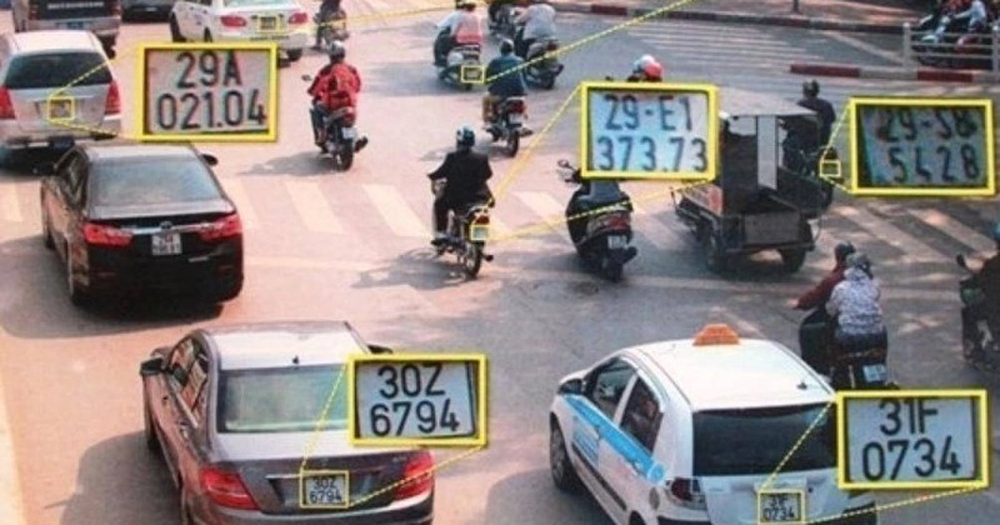
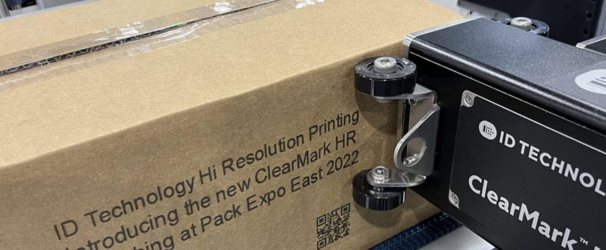

é¡ä¸æœ‰åˆï¼Œé²œå…‹æœ‰ç»ˆ Mí bù yÇ’u chÅ«, xiÄn kè yÇ’u zhÅng Má»i thứ Ä‘á»u có khởi đầu, nhÆ°ng it khi Ä‘i tá»›i tận kết thúc trá»n vẹn.

# Cải thiện độ trễ khi xử lý ảnh của mô hình ngôn ngữ lớn bằng cách cho mô hình ngôn ngữ lớn khả năng đẻ ra mô hình AI-Vision giúp chính bản thân mô hình ngôn ngữ lớn nhận diện hình ảnh tốt hơn.

Cách AI tạo ra AI.

Author: *Tran Van Tuan - Foxconn AI Research

Tóm tắt: Trí tuệ nhân tạo bùng nổ, gần đây nhất là sá»± phát triển vượt bậc của các mô hình ngôn ngữ lá»›n, tuy nhiên khi xét trong môi trÆ°á»ng công nghiệp sản xuất, các yêu cầu vá» kiểm tra hàng hóa sá»­ dụng AI-Vision nhÆ° YOLOv8 đôi khi lại rất phức tạp, không tối Æ°u cho ngÆ°á»i sá»­ dụng, yêu cầu ngÆ°á»i sá»­ dụng phần má»m có kiến thức chuyên môn cao. Quay lại chủ Ä‘á» mô hình ngôn ngữ lá»›n, các LLM ngày nay thÆ°á»ng hÆ°á»›ng đến yếu tố là multi-modal tức là đầu vào input không chỉ là text mà còn là hình ảnh, âm thanh, tín hiệu, video, etc, dẫn đến Ä‘á»™ trá»… đầu ra rất lá»›n, vấn Ä‘á» này là không thể chấp nhận trong sản xuất công nghiệp nÆ¡i mà yêu cầu vá» Ä‘á»™ chính xác và tốc Ä‘á»™ luôn là Æ°u tiên số má»™t. HÆ¡n nữa trong môi trÆ°á»ng sản xuất không có quá nhiá»u nguồn lá»±c để đầu tÆ° phần cứng giúp tăng tốc inference mô hình ngôn ngữ lá»›n khi xá»­ lý đầu vào hình ảnh, video. Vì vậy nghiên cứu này bÆ°á»›c đầu Ä‘á» xuất má»™t phÆ°Æ¡ng pháp giúp mô hình ngôn ngữ lá»›n tối Æ°u hóa thá»i gian inference vá»›i đầu vào là image, bằng cách cho phép mô hình ngôn ngữ lá»›n khả năng tá»± training, tá»± huấn luyện má»™t mô hình AI-Vision con kết hợp vá»›i các phÆ°Æ¡ng pháp prunning và distillation giúp cho mô hình con là AI-Vision tối Æ°u hóa thá»i gian inference, trích xuất các đặc trÆ°ng và Ä‘Æ°a lại thông tin vá» cho mô hình ngôn ngữ mẹ. 

Tổng quan, mô hình ngôn ngữ mẹ nhận đầu vào là ảnh thì nó sẽ tá»± training má»™t mô hình con là AI-Vision trích xuất các thông tin trên ảnh nhÆ° là số lượng vật thể, số lượng chó, số lượng mèo, etc có trong ảnh rồi từ đó mô hình con AI-Vision gá»­i thông tin trích xuất được lại vá» cho mô hình ngôn ngữ mẹ. PhÆ°Æ¡ng pháp vẫn là dá»±a trên toán xác xuất nhÆ°ng ta có thể ứng dụng vào mô trÆ°á»ng công ty sản xuất nhÆ° Foxconn, để giám sát check lá»—i sản phẩm.

I. Introduction 
Äể thá»±c hiện nghiên cứu này, trÆ°á»›c tiên ta cần má»™t mô hình ngôn ngữ lá»›n có khả năng multi-modal và reasoning mạnh ví dụ MiniCPM-o của OpenBMB.

**Kịch bản 1**

Prompt giám sát giao thông: Bạn là cảnh sát giao thông, camera sẽ gá»­i ảnh cho bạn, hãy phân tích bức ảnh và xác định các đối tượng vi phạm giao thông, hiển thị, lÆ°u trữ thông tin biển số xe. Äá»™ trá»… phải nhá» hÆ¡n 200 ms và Ä‘á»™ chính xác phải là cao nhất có thể.



AI-Agent suy nghĩ:
```
Tôi cần phải phân tích bức hình này và xác định các hành vi vi phạm giao thông.

Tôi là mô hình ngôn ngữ lá»›n DeepSeek-r1, tôi không có khả năng Ä‘á»c hiểu ảnh, tôi sẽ gá»­i nó cho má»™t mô hình ngôn ngữ lá»›n khác là OpenBMB-MiniCPM-o để trích xuất thông tin ảnh. 

Mô hình ngôn ngữ OpenBMB-MiniCPM-o đã gá»­i thông tin vá» cho tôi rồi, bây giá» tôi có thể hiểu được bức ảnh này chứa thông tin gì, tôi sẽ kết hợp thông tin bức ảnh vá»›i prompt của ngÆ°á»i dùng và training má»™t mô hình AI-Vision OCR có khả năng trích xuất hình ảnh biển số xe vi phạm giao thông. 
```

**Kịch bản 2** 
Prompt check lỗi ngoại quan sản phẩm: Tôi muốn kiểm tra chất lượng chữ cái trên thùng hàng carton này xem chữ in có đủ không, có bị nhòe mực không, có bị mỠkhông, có bị ngược chữ không, etc. 



AI-Agent suy nghĩ
```
Do là mô hình ngôn ngữ lá»›n nên thá»i gian xá»­ lý của tôi rất chậm, vì thế tôi sẽ training má»™t mô hình AI-Vision dá»±a trên PaddlePaddle framework để trích xuất OCR chữ vá» cho tôi để tôi xá»­ lý chữ xem có đủ không.
```

# II. Approach

```
🧑â€ğŸ¦°: I'm a manufacture work in a factory, my client wanna check if the text on the box is complete, misaligned, or blurred.
```


```
🤖: Tôi là một mô hình ngôn ngữ lớn có khả năng xử lý hình ảnh, tuy nhiên, quá trình này có thể gây ra độ trễ cao. Vì vậy, tôi sẽ **tự huấn luyện một mô hình AI-Vision** chuyên biệt để xử lý hình ảnh một cách hiệu quả hơn.  

### **Công nghệ sử dụng trong hệ thống AI-Vision:**  
1. **OCR (Optical Character Recognition)** – Trích xuất văn bản từ hình ảnh.  
2. **YOLOv8** – Nhận diện và theo dõi vị trí văn bản theo thá»i gian thá»±c.  
3. **Phân tích hình ảnh với OpenCV:**  
   - **Edge Detection** – Phát hiện cạnh để kiểm tra độ sắc nét của văn bản.  
   - **Frequency Domain Analysis** – Phân tích tần số để xác định độ nét.  
   - **Variance of Laplacian** – Äánh giá mức Ä‘á»™ má» của hình ảnh.  

---

### **Quy trình xử lý dữ liệu:**  
- Tôi cần **10 mẫu ảnh đầu vào** từ bạn.  
- Sau đó, tôi sẽ sá»­ dụng **Generative AI** để tạo thêm dữ liệu huấn luyện từ các mẫu ảnh này, đảm bảo mô hình có đủ dữ liệu để há»c tập hiệu quả.  

---

### **Quy trình huấn luyện:**  
- Tôi sẽ huấn luyện mô hình với **100 epochs**,  
- **Learning rate = 0.001**,  
- Sá»­ dụng **Adam Optimizer** để tối Æ°u hóa quá trình há»c.  

---

### **Quá trình suy luận (Inference Optimization):**  
- Tôi sẽ sử dụng **PaddlePaddle Framework** để tối ưu hóa mô hình.  
- Ãp dụng các thuật toán **Pruning** (giảm số lượng tham số không quan trá»ng) và **Distillation** (trích xuất kiến thức từ mô hình lá»›n sang mô hình nhá»).  
- Äảm bảo **kích thÆ°á»›c mô hình < 20MB** nhÆ°ng vẫn đạt Ä‘á»™ chính xác cao.  

â³ **Dá»± kiến thá»i gian hoàn thành: 5 giá».**  
Bạn có muốn tôi bắt đầu ngay không? 🚀  

---

### **English Version (Clear & Accurate)**  

🤖: I am a large language model capable of processing images, but this can cause **high latency**. To improve efficiency, I will **train a dedicated AI-Vision model** for image processing.  

### **Technologies Used in the AI-Vision System:**  
1. **OCR (Optical Character Recognition)** – Extracts text from images.  
2. **YOLOv8** – Detects and tracks text position in real-time.  
3. **Image Processing with OpenCV:**  
   - **Edge Detection** – Identifies sharpness and edges in text.  
   - **Frequency Domain Analysis** – Analyzes frequency components to assess clarity.  
   - **Variance of Laplacian** – Evaluates blurriness in the image.  

---

### **Data Processing Workflow:**  
- I need **10 sample images** from you.  
- Using **Generative AI**, I will generate additional training samples based on these images to improve model learning.  

---

### **Training Process:**  
- The model will be trained with **100 epochs**.  
- **Learning rate = 0.001**.  
- Optimized using **Adam Optimizer**.  

---

### **Inference Optimization:**  
- I will use **PaddlePaddle Framework** to optimize the vision model.  
- Apply **Pruning** (removing redundant parameters) and **Distillation** (transferring knowledge from a larger model to a smaller one).  
- Ensure **model size < 20MB** while maintaining high accuracy.  

â³ **Estimated completion time: 5 hours.**  
Would you like me to start now? 🚀  
```